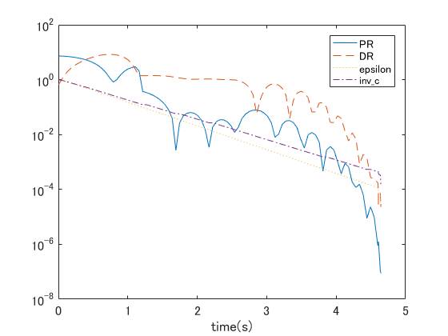
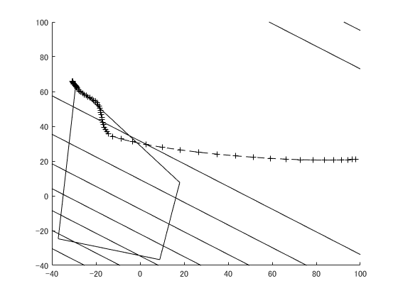

# Introduction
MATLAB sources for the augmented Lagrangian method

# Execution

Run the following.
```
exp_AL_quad
```
It solve a convex quadratic problem whose parameters are read from `prob_quad_var2_ineq4.mat`.
You see the following graph.
The horizontal axis is the execution time in second.
`PR` and `DR` are primal and dual residuals (errors), respectively.
`inv_c` and `epsilon` are parameters of the augmented Lagrangian, which control `PR` and `DR`, respectively.



The result is saved in `result_AL.mat`.
The source of the augmented Lagrangian is `augmented_Lagrangian.m`.

Run the following.
```
plot_prob_quad
```
Then, you see the following plot of the quadratic problem and the trajectory obtained by the augmented Lagrangian.


